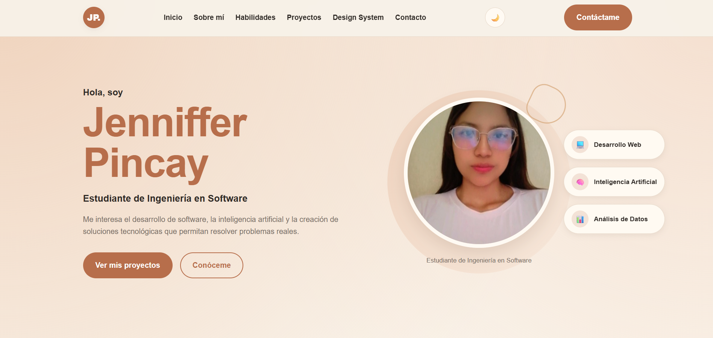
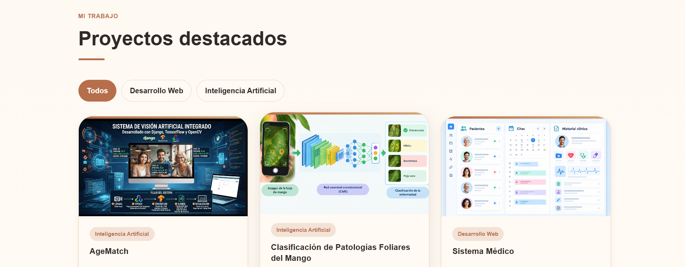
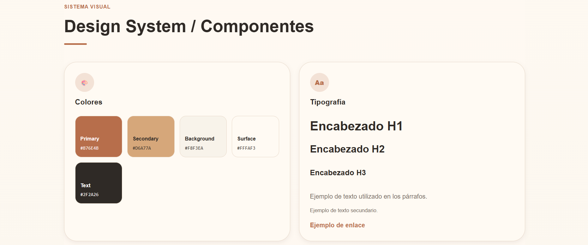

# Portafolio Personal - Jenniffer Pincay

Este proyecto corresponde a un portafolio web personal desarrollado con HTML, CSS y JavaScript.

El objetivo del sitio es presentar de manera clara información académica y profesional, habilidades técnicas, proyectos destacados y componentes reutilizables mediante un Design System.

El portafolio también incorpora funcionalidades interactivas desarrolladas con JavaScript y se encuentra publicado mediante GitHub Pages.

---

## Tecnologías utilizadas

- HTML5
- CSS3
- JavaScript
- Git
- GitHub
- GitHub Pages
- Formspree

---

## Funcionalidades principales

El portafolio incorpora diferentes funcionalidades para mejorar la experiencia del usuario:

- Menú responsive para dispositivos móviles.
- Cambio entre tema claro y oscuro.
- Persistencia de la preferencia de tema mediante `localStorage`.
- Filtro de proyectos por categoría.
- Modal para visualizar información adicional de los proyectos.
- Validación del formulario de contacto.
- Envío de mensajes mediante Formspree.
- Navegación interna entre las diferentes secciones del portafolio.
- Diseño adaptable para computadoras, tablets y teléfonos móviles.

---

## Secciones del portafolio

El sitio está compuesto por las siguientes secciones:

- Inicio.
- Sobre mí.
- Habilidades.
- Proyectos destacados.
- Design System / Componentes.
- Contacto.

---

## Proyectos destacados

### AgeMatch

Sistema desarrollado con tecnologías de inteligencia artificial y visión por computadora para detectar edad y emociones mediante una cámara.

El proyecto permite analizar características faciales y utilizar los resultados para generar recomendaciones.

**Tecnologías utilizadas:**

- Python.
- Django.
- TensorFlow.
- OpenCV.

---

### Clasificación de Patologías Foliares del Mango mediante Redes Neuronales Convolucionales

Proyecto de inteligencia artificial orientado a la clasificación automática de enfermedades presentes en hojas de mango a partir de imágenes.

Se utilizaron diferentes arquitecturas de redes neuronales convolucionales para comparar su rendimiento.

**Tecnologías utilizadas:**

- Python.
- TensorFlow.
- Keras.
- MobileNetV2.
- ResNet50.
- DenseNet121.

---

### Sistema Médico

Aplicación web diseñada para apoyar la gestión de pacientes, citas médicas y registros clínicos mediante una interfaz organizada y fácil de utilizar.

El sistema busca facilitar la organización y consulta de información relacionada con la atención médica.

**Tecnologías utilizadas:**

- HTML.
- CSS.
- JavaScript.
- Base de datos.

---

## Habilidades mostradas

Dentro del portafolio se presentan diferentes habilidades y tecnologías utilizadas durante la formación académica, entre ellas:

- HTML5.
- CSS3.
- JavaScript.
- Python.
- R.
- PostgreSQL.
- Git.
- Power BI.

---

## HTML5 semántico

La estructura del sitio utiliza etiquetas semánticas de HTML5 para representar correctamente cada parte de la página.

Entre las principales etiquetas utilizadas se encuentran:

```html
<header>
<nav>
<main>
<section>
<article>
<aside>
<figure>
<figcaption>
<form>
<footer>

## Capturas del proyecto

### Página principal



### Proyectos destacados



### Design System

